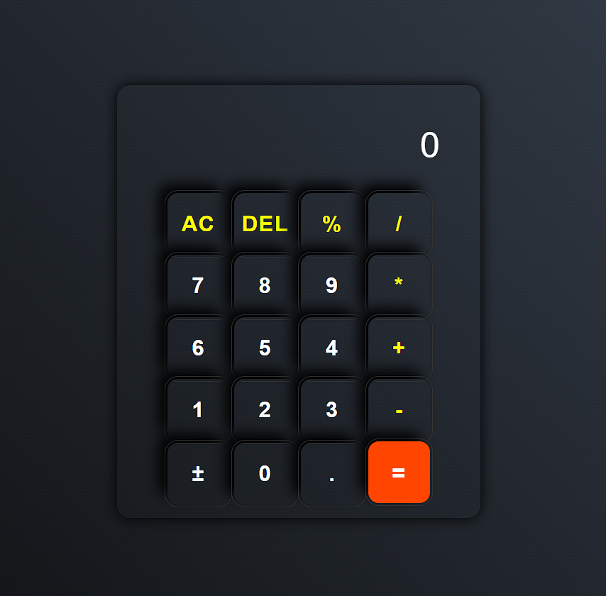

# Calculator App

A simple and responsive Calculator application built using **HTML**, **CSS**, and **JavaScript**. It can perform basic arithmetic operations such as addition, subtraction, multiplication, and division, including float (decimal) numbers.

## 🔍 Features

- Simple and user-friendly interface
- Responsive layout
- Supports:
  - Addition (`+`)
  - Subtraction (`-`)
  - Multiplication (`*`)
  - Division (`/`)
  - Percentage (`%`)
  - Decimal numbers
  - Clear (`AC`)
  - Delete last digit (`DE`)
  - Plus-Minus toggle (`±`)
- Keyboard disabled for input to avoid invalid characters

## 🛠️ Technologies Used

- **HTML** – to build the structure
- **CSS** – to style and design the UI
- **JavaScript** – to handle calculator logic and interactivity

## 🖼️ Preview

 

## 🚀 How to Use

1. Clone the repository or download the project files.
2. Open `index.html` in your web browser.
3. Click the buttons to perform calculations.

## 📁 Project Structure

